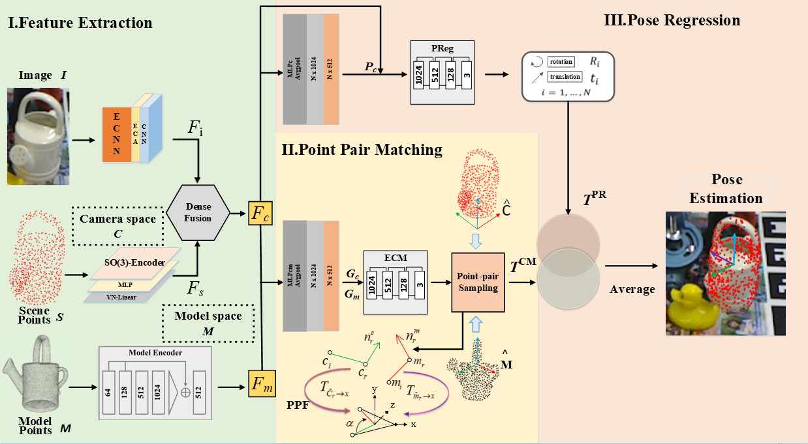

# EPM-Net
Code for "EPM-Net: Efficient Feature Extraction, Point-pair Feature Matching for Robust 6D Pose Estimation"



## Requirements
* Open3D==0.16.0
* python==3.7.13
* OpenCV==4.6.0
* Pytorch==1.7.0
* CUDA==11.4

## Downloads
* YCB-Video dataset [[link](https://rse-lab.cs.washington.edu/projects/posecnn/)]
* Preprocesssed LineMOD dataset (refer from DenseFusion) [[link](https://hkustconnect-my.sharepoint.com/personal/yhebk_connect_ust_hk/_layouts/15/onedrive.aspx?id=%2Fpersonal%2Fyhebk%5Fconnect%5Fust%5Fhk%2FDocuments%2Fpublically%20shared%20%E5%85%B1%E4%BA%AB%E6%96%87%E4%BB%B6%E5%A4%B9%2F6D%5Fpose%5Fdatasets%2FLinemod%5Fpreprocessed%2Ezip&parent=%2Fpersonal%2Fyhebk%5Fconnect%5Fust%5Fhk%2FDocuments%2Fpublically%20shared%20%E5%85%B1%E4%BA%AB%E6%96%87%E4%BB%B6%E5%A4%B9%2F6D%5Fpose%5Fdatasets&ga=1)]
* Pred mask of PVN3D on YCB-Video dataset [[link](https://drive.google.com/file/d/1ftLn9itGQtjx5QM7SfOousIL44olIcm9/view?usp=sharing)]
* Pred mask of HybirdPose on LineMOD Occlusion dataset [[link](https://drive.google.com/file/d/1Jwp-J6opAAvtbMV1ewzhpBLoSjmZoMVJ/view)]

## Train
Train our EPM-Net:

For YCB-Video dataset and LineMOD dataset, run:
```python
python train.py --dataset ycbv --dataset_root path_to_ycbv_dataset
python train.py --dataset linemod --dataset_root path_to_lm_dataset
```
For LineMOD Occlusion dataset, download the [[VOC2012 dataset](http://host.robots.ox.ac.uk/pascal/VOC/voc2012/VOCtrainval_11-May-2012.tar)] and run:
```python
python train.py --dataset lmo --dataset_root path_to_lmo_dataset --bg_img path_to_voc2012_dataset
```
## Evaluation
Evaluate our EPM-Net:

```python
python eval_ycbv.py --dataset_root path_to_ycbv_dataset --pred_mask path_to_pvn3d_pred_mask
python eval_lm.py --dataset_root path_to_lm_dataset
python eval_lmo.py --dataset_root path_to_lm_dataset --pred_mask path_to_hybirdpose_pred_mask
```
## Results
ADD(-S) performance on Occlusion LineMOD dataset

| Method | --- | PoseCNN | Pix2Pose | PVNet | HybirdPose | PVN3D | PRGCN | BiCo-Net | EPM-Net |
| Average of ADD(-S) | --- | 24.9 | 32.0 | 40.8 | 47.5 | 63.2 | 65.0 | 69.5 | 74.9 |

## Acknowledgement
* Our implementation leverages the code from [[BiCo-Net](https://github.com/Gorilla-Lab-SCUT/BiCo-Net)]
